# Server Maintenance SOP

This is a handbook for the maintenance of the server. It includes the daily tasks that need to be done to keep the server running smoothly.

## Prerequisite knowledge

If you are not familiar with the server, you should learn the following knowledge first. Trust me it's worth it.
[The Missing Semester of Your CS Education](https://missing.csail.mit.edu/).

Some more specific knowledge about the Linux and vim:

* [shell十三问](http://bbs.chinaunix.net/thread-218853-1-1.html)
* [Linux From Scratch](https://www.linuxfromscratch.org/lfs/)
* [Vim Cheat Sheet](https://vim.rtorr.com/)

## Reinstall the system

Although we want everyone to use docker, we also know that for some older servers, the consequences of reinstalling the system can be devastating. But sometimes we have to reinstall the system for it.

*Attention: The commands below are mostly in Ubuntu22.04.*

### OS Selection

The OS of the server is any Linux distribution. The most common one is Ubuntu. Because the elderly version of Ubuntu may not be supported in security and some libs. If there is no extra requirement, such as specific software or library, I advise using the latest LTS version of Ubuntu, for now, it is 22.04.

|                                       | RELEASED | END OF STANDARD SUPPORT | END OF UBUNTU PRO SUPPORT |
| ------------------------------------- | -------- | ----------------------- | ------------------------- |
| 23.10 (Mantic Minotaur)               | Oct 2023 | Jul 2024                |                           |
| 23.04 (Lunar Lobster)                 | Apr 2023 | Jan 2024                |                           |
| **22.04 LTS (Jammy Jellyfish)** | Apr 2022 | Apr 2027                | Apr 2032                  |
| **20.04 LTS (Focal Fossa)**     | Apr 2020 | Apr 2025                | Apr 2030                  |
| **18.04 LTS (Bionic Beaver)**   | Apr 2018 | Apr 2023                | Apr 2028                  |
| **16.04 LTS (Xenial Xerus)**    | Apr 2016 | Apr 2021                | Apr 2026                  |
| **14.04 LTS (Trusty Tahr)**     | Apr 2014 | Apr 2019                | Apr 2024                  |

Typically, we need the ISO file to install the system.

You can download the latest version of Ubuntu from the [official website](https://ubuntu.com/download/server).

### Reinstall Preparation

#### Backup

We all do not want to lose valuable data, right?

So before reinstalling the system, we need to confirm the data that needs to be backed up.

**For docker users**, it's relatively easy. We can do this seamlessly by exporting the containers and volumes.

For example, the name of the container we want to backup is marinaio.

We can use the below command to store the container as a .tar file.

```shell
docker export marinaio > /home/marinaio-01.tar
```

After reinstalling, you can use the below command to get them back again:

```shell
docker import /home/marinaio-01.tar
```

**For the user on the host machine**, we cannot save all the data in the same way as docker. We need to choose the data manually.

##### Where the data goes

The data can be backed up to another server, or a local disk. The choice depends on the state of the server.

* If the server has enough space, we can back up the data to the local disk. It's not an efficient way, but it needs no extra resources.

  1. Identify Unused Disk Space
     First, identify the unused disk or partition where you will store your backup. Use the lsblk command to list all block devices:

     ```shell
     lsblk
     ```

     Look for a partition or disk that does not have a mount point and has sufficient space for your backup.
  2. Prepare the Backup Partition
     If the unused disk or partition is not formatted, you need to format it. For example, to format a partition as ext4, replace /dev/sdx1 with your actual partition:

  ```shell
  sudo mkfs.ext4 /dev/sdx1
  ```

  Warning: Formatting a partition will erase all data on it. Ensure you're formatting the correct partition.

  Create a mount point and mount the partition:

  ```shell
  sudo mkdir /mnt/backup
  sudo mount /dev/sdx1 /mnt/backup
  ```

  3. Backup Data to the Partition
     Copy the files you want to keep to the mounted partition. For example, to back up your home directory:

  ```shell
  sudo rsync -av /home/ /mnt/backup/home_backup/
  ```

  4. Record Partition Information

     Before reinstalling the OS, note the partition's UUID for easier remounting later. Use the `blkid` command:

     ```shell
     sudo blkid
     ```
  5. Reinstall Ubuntu
     Proceed with reinstalling Ubuntu. During the installation process, be careful not to format the backup partition. Ubuntu's installer allows you to choose which partitions to format.
  6. Remount the Backup Partition
     After reinstalling, remount your backup partition to access your data. You can add it to `/etc/fstab` for automatic mounting. Edit `/etc/fstab` and add a line like this:

     ```bash
     UUID=your-partition-uuid  /mnt/backup  ext4  defaults  0  2
     ```

     Replace `your-partition-uuid` with the actual UUID noted earlier. Then, mount all:

     ```
     sudo mount -a
     ```
  7. Restore Data
     Finally, restore the data from the backup location to wherever you need it on your new system. For example:

     ```
     sudo rsync -av /mnt/backup/home_backup/ /home/
     ```
* If the server does not have enough space, we can back up the data to another server.
  The Basc Syntax of scp command in Linux is as follows:

  ```shell
  scp [options] [[user@]host1:]source_file_or_directory ... [[user@]host2:]destination
  ```

  In this syntax:

  * **`<strong>options</strong>`** : These are various options that modify the behavior of the SCP command, such as `<span>-i</span>` for specifying an identity file, `<span>-l</span>` for limiting bandwidth, `<span>-o</span>` for specifying SSH options, `<span>-P</span>` for specifying a custom SSH port, and `<span>-S</span>` for specifying a program to use for the encrypted connection.
  * **`<strong>[[user@]host1:]source_file_or_directory</strong>`** : This represents the source file or directory. It can be local or on a remote machine specified by `<span>user@host1:</span>`.
  * **`<strong>...</strong>`** : This indicates that you can specify multiple source files or directories.
  * **`<strong>[[user@]host2:]destination</strong>`** : This is the destination where the files or directories will be copied. It can be local or on a remote machine specified by `<span>user@host2:</span>`.

#### Reinstall

You can get the management address of the server from the tencent document.

Enter the ip address in the browser, and you will see the management page.

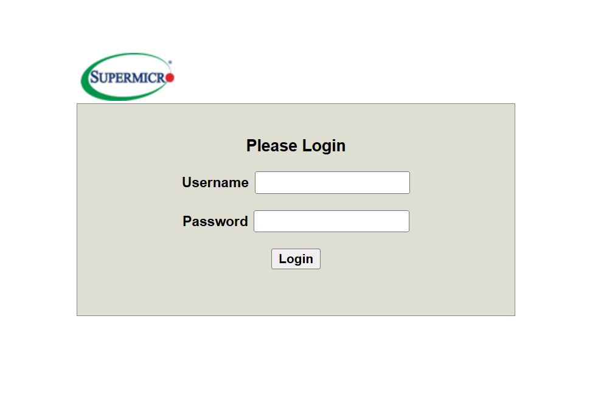

Enter the admin account and password, and you will see the management page.

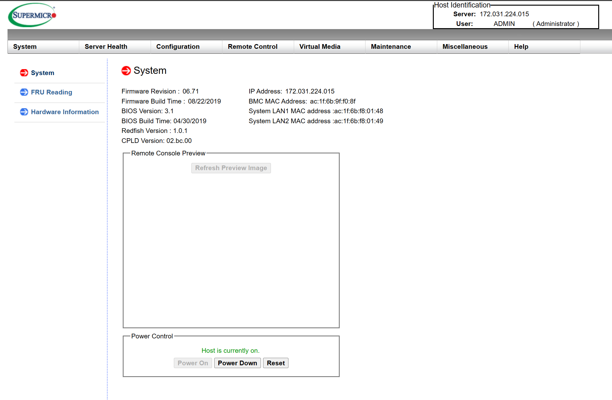

Click Remote control, and you will see the following page.

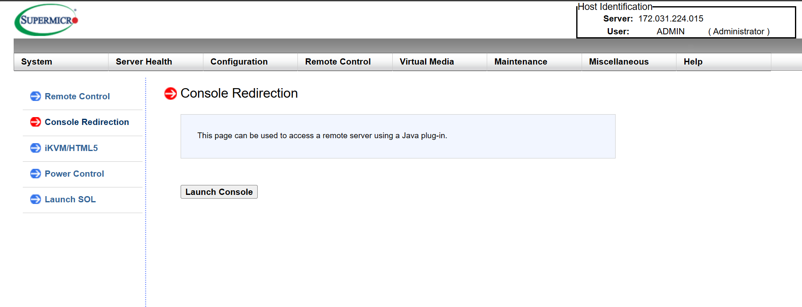

Because we need to virtual plug in the ISO file, we need to choose "Console Redirection".

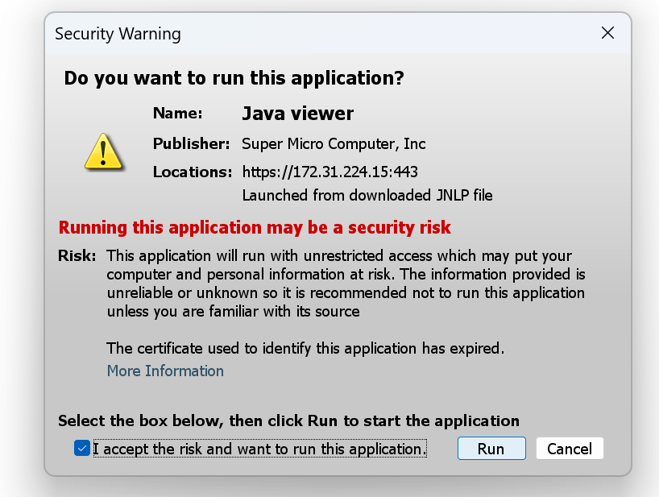

If it's your first time to connect to the console, you may need to install the java jre and configure some properties.

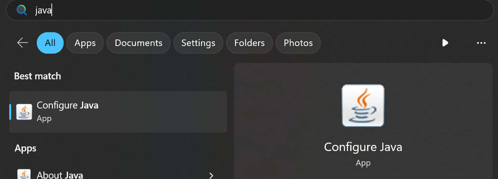

You need to add the ip address of the server to the exception list.

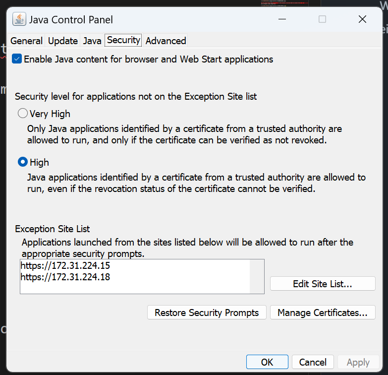

And in "Advanced", you need to make "Perform signed code certificate revocation checks on" to "Do not check".

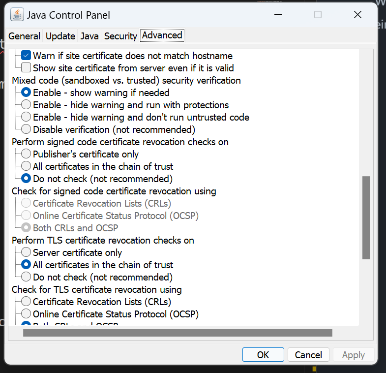

If you have done all the above, you can see the console.

However, there still may be some problems on specific servers. Then I recommend you to use the "IPMIView" from supermicro.

You can download it from the [official website](https://www.supermicro.com/en/support/resources/downloadcenter/smsdownload?category=IPMI).

After installing, you can see the following page.
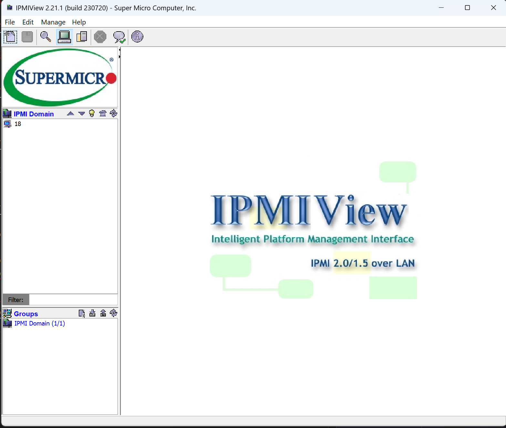

Login and you can see the console.
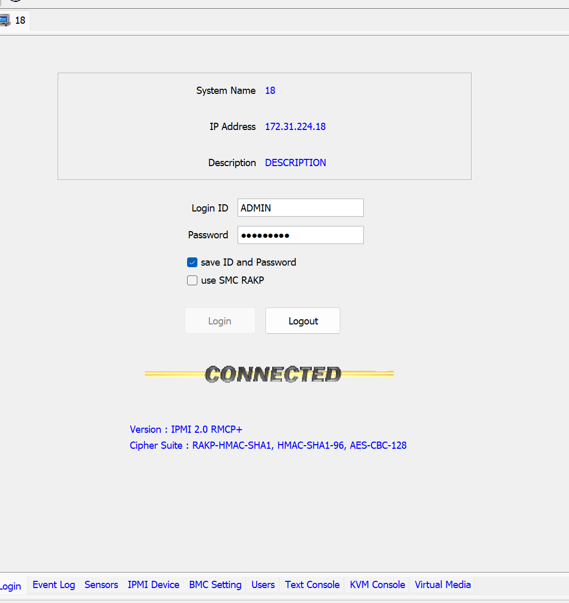

Whatever the way you choose, you can see the console like this:

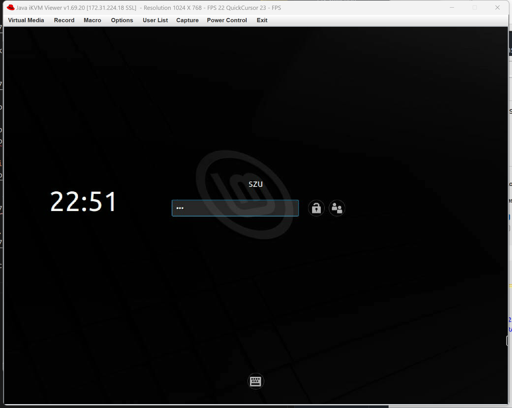

Click "Virtual Media" and you can see the following page.

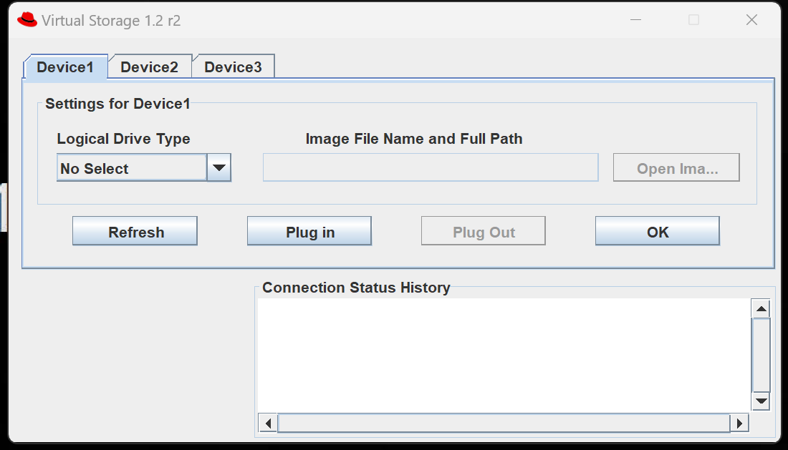

Select the ISO file and click "Plug in".
Then reboot the server, and choose the boot from the virtual CD-ROM.

After that, you can install the system as you like.

Click "Virtual Media" again, and click "Plug out" to unplug the ISO file.

Congratulations! You have reinstalled the system.

## Nvidia Driver Installation

Here is a common operation: Change the apt source to the domestic source.

THU and USTC are the most common sources.

[THU](https://mirrors.tuna.tsinghua.edu.cn/)
[USTC](https://mirrors.ustc.edu.cn/)

一般情况下，将 /etc/apt/sources.list 文件中 Ubuntu 默认的源地址 http://archive.ubuntu.com/ 替换为 http://mirrors.ustc.edu.cn/ 即可。

```shell
sudo apt update && sudo apt upgrade -y
sudo ubuntu-drivers autoinstall
```

## Docker Installation with Nvidia-container-toolkit

### install docker

```shell
sudo apt install ca-certificates curl gnupg lsb-release
sudo mkdir -p /etc/apt/keyrings
curl -fsSL https://download.docker.com/linux/ubuntu/gpg | sudo gpg --dearmor -o /etc/apt/keyrings/docker.gpg
echo "deb [arch=$(dpkg --print-architecture) signed-by=/etc/apt/keyrings/docker.gpg] https://download.docker.com/linux/ubuntu $(lsb_release -cs) stable"  | sudo tee /etc/apt/sources.list.d/docker.list > /dev/null
sudo apt update
sudo apt-get install docker-ce docker-ce-cli containerd.io docker-compose-plugin
sudo usermod -aG docker $(whoami)
sudo reboot
docker version
```

1. Configure the production repository:

   ```shell
   $ curl -fsSL https://nvidia.github.io/libnvidia-container/gpgkey | sudo gpg --dearmor -o /usr/share/keyrings/nvidia-container-toolkit-keyring.gpg \
   && curl -s -L https://nvidia.github.io/libnvidia-container/stable/deb/nvidia-container-toolkit.list | \
       sed 's#deb https://#deb [signed-by=/usr/share/keyrings/nvidia-container-toolkit-keyring.gpg] https://#g' | \
       sudo tee /etc/apt/sources.list.d/nvidia-container-toolkit.list
   ```
   Optionally, configure the repository to use experimental packages:

   ```shell
   $ sed -i -e '/experimental/ s/^#//g' /etc/apt/sources.list.d/nvidia-container-toolkit.list
   ```

2. Update the packages list from the repository:
        ```shell
        $ sudo apt-get update
        ```

3. Install the NVIDIA Container Toolkit packages:
    ```shell
    sudo apt-get install -y nvidia-container-toolkit
    sudo nvidia-ctk runtime configure --runtime=docker
    sudo systemctl restart docker
    ```
