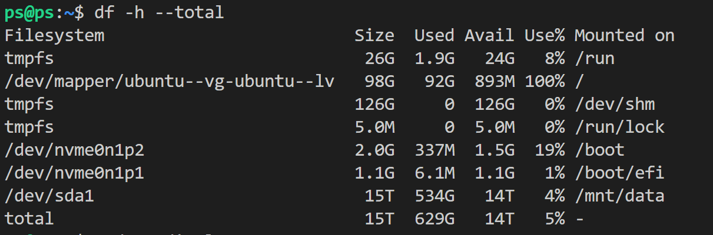
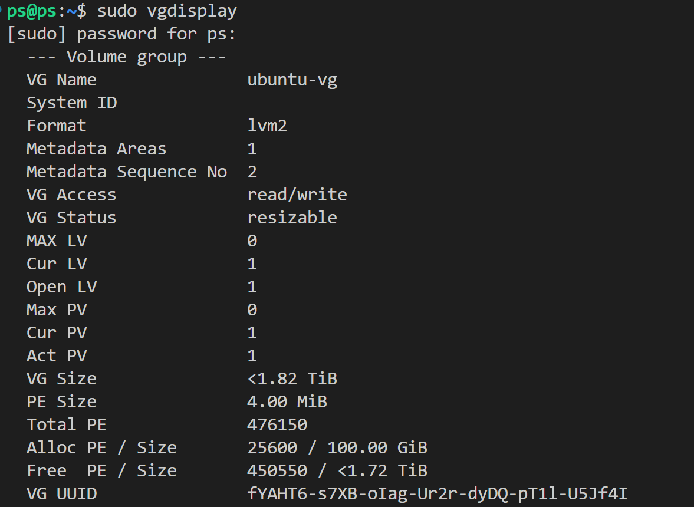
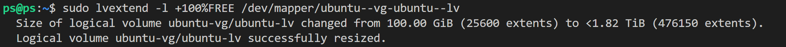
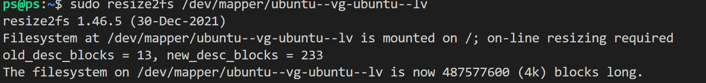
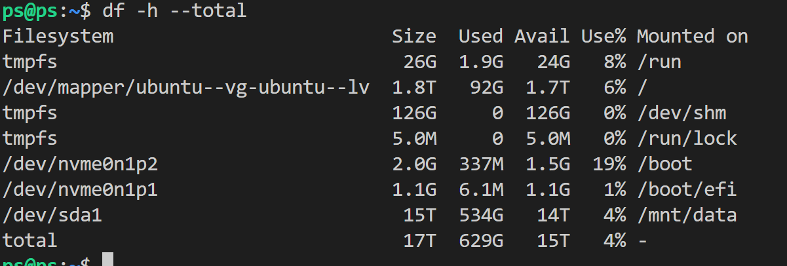

# 拓展逻辑卷

**注意，不要直接复制命令，核对好分区名**

案例情况：

安装软件时发现报错：


通过命令 df 查看当前磁盘空间状态：


发现根文件系统 (`/`) 的磁盘空间几乎已经满了（92G 使用，只剩 893M 可用），这就是安装时出现 "No space left on device" 错误的原因。

奇怪的是它本身不该这么小。如果物理卷（PV）或卷组（VG）中还有未分配的空间，可以扩展这个逻辑卷。使用以下命令查看是否有可用空间：

```bash
sudo vgdisplay
```



可以看出这里还有未分配的空间大约1.72T（好家伙

为了使用所有可用的空间，运行以下命令：

```bash
sudo lvextend -l +100%FREE /dev/mapper/ubuntu--vg-ubuntu--lv
```



紧接着：

```bash
sudo resize2fs /dev/mapper/ubuntu--vg-ubuntu--lv
```



最后查看当前磁盘信息，已经成功将未分配空间分配出来辣

