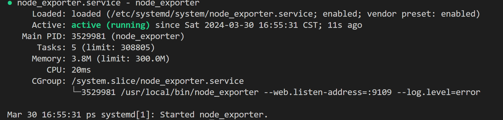
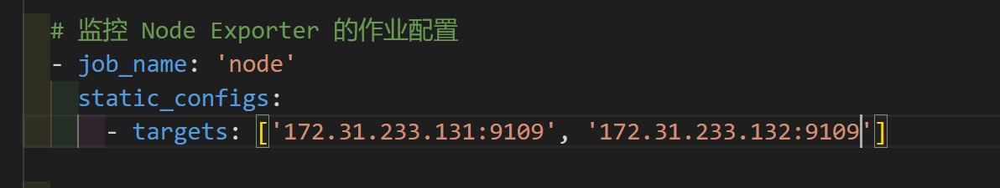

# 服务器资源的监测管理

目前该系统主要包含两套框架，一套是基于Prometheus+Grafana（PG），另一套是基于Portainer。

两者的监控总端均在172.31.233.120上，因此对这台服务器的操作需要小心谨慎。

PG的优势在于可以全面的监控服务器的资源使用情况，但这个框架并没有实质操作docker的功能。Portainer则是一个docker的图形化管理工具，可以方便的对docker进行操作。介于我们并没有足够的成本从零开发一个系统，因此我们选择了这两套框架进行整合。全面、成本、效率三者不可能既要又要全要:D。

## Prometheus+Grafana


## 系统组件

中心控制端：

* Prometheus
* Grafana
* Rust server

被监控端：

* Node explorer
* Rust client

## 流程

## 各组件安装

### Node Explorer

直接拉取此版本Node Explorer

```bash
wget https://github.com/prometheus/node_exporter/releases/download/v1.7.0/node_exporter-1.7.0.linux-amd64.tar.gz
```

解压：

```
tar -zxvf node_exporter-1.7.0.linux-amd64.tar.gz 
```

移动：

```
cd node_exporter-1.7.0.linux-amd64
```

```
sudo mv node_exporter /usr/local/bin/
```

新增一个系统服务：

```
sudo  vi /etc/systemd/system/node_exporter.service
```

输入以下内容：

```
[Unit]
Description=node_exporter
After=network.target
[Service]
Type=simple
User=root
ExecStart=/usr/local/bin/node_exporter --web.listen-address=:9109 --log.level=error
MemoryLimit=300M
CPUQuota=100%
Restart=on-failure
[Install]
WantedBy=multi-user.target
```

启动并设置开启自启：

```
sudo systemctl daemon-reload \
sudo systemctl start  node_exporter.service \
sudo systemctl enable node_exporter.service \
sudo systemctl status node_exporter.service
```

Output should be like:


回到中控端， 在 Prometheus 的配置文件中增加该节点的信息



重启Prometheus。完成

## nvidia_gpu_exporter

```bash
wget https://github.com/utkuozdemir/nvidia_gpu_exporter/releases/download/v1.2.0/nvidia_gpu_exporter_1.2.0_linux_x86_64.tar.gz
```

``` bash
tar -zxvf nvidia_gpu_exporter_1.2.0_linux_x86_64.tar.gz 
```

```bash
sudo mv nvidia_gpu_exporter/ /usr/bin
```

```bash
sudo vim /etc/systemd/system/nvidia_gpu_exporter.service
```

```
[Unit]
Description=Nvidia GPU Exporter
After=network-online.target

[Service]
Type=simple

User=nvidia_gpu_exporter
Group=nvidia_gpu_exporter

ExecStart=/usr/bin/nvidia_gpu_exporter

SyslogIdentifier=nvidia_gpu_exporter

Restart=always
RestartSec=1

[Install]
WantedBy=multi-user.target
```

```bash
sudo systemctl daemon-reload
```

```bash
sudo systemctl enable --now nvidia_gpu_exporter
```
