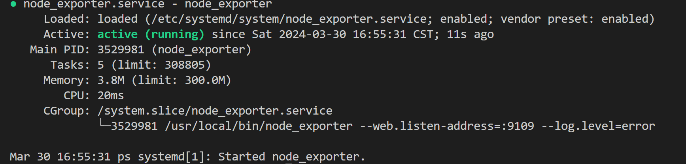

# 服务器资源监控系统

## 系统组件

中心控制端：

* Prometheus
* Grafana
* Rust server

被监控端：

* Node explorer
* Rust client

## 流程

## 各组件安装

### Node Explorer

直接拉取此版本Node Explorer

```bash
wget https://github.com/prometheus/node_exporter/releases/download/v1.7.0/node_exporter-1.7.0.linux-amd64.tar.gz
```

解压：

```
tar -zxvf node_exporter-1.7.0.linux-amd64.tar.gz 
```

移动：

```
sudo mv node_exporter /usr/local/bin/
```

新增一个系统服务：

```
sudo  vi /etc/systemd/system/node_exporter.service
```

输入以下内容：

```
[Unit]
Description=node_exporter
After=network.target
[Service]
Type=simple
User=root
ExecStart=/usr/local/bin/node_exporter --web.listen-address=:9109 --log.level=error
MemoryLimit=300M
CPUQuota=100%
Restart=on-failure
[Install]
WantedBy=multi-user.target
```

启动并设置开启自启：

```
sudo systemctl daemon-reload
sudo systemctl start  node_exporter.service
sudo systemctl enable node_exporter.service
sudo systemctl status node_exporter.service
```

Output should be like:


回到中控端， 在 Prometheus 的配置文件中增加该节点的信息


重启Prometheus。完成
